# wordless-backend-rest-api

## リポジトリの概要

本リポジトリは Wordless の REST API のバックエンド実装です。
構成は、 **API Gateway(REST API) + AWS Lambda(Node.js)** です。

プロジェクトの概要は [フロントエンドリポジトリ](https://github.com/kagamaru/wordless-client) のREADMEをご覧ください

## リポジトリの技術要素

| 実現機能            | パッケージ名                                   | バージョン |
| ------------------- | ---------------------------------------------- | ---------- |
| IaC、デプロイメント | [serverless-http](https://www.serverless.com/) | 3.2.0      |
| テスト              | [jest](https://jestjs.io/)                     | 29.7.0     |
| 日付変換            | [dayjs](https://day.js.org/)                   | 1.11.13    |
| コードの静的解析    | [eslint](https://eslint.org/)                  | 9.17.0     |
| コードフォーマット  | [prettier](https://prettier.io/)               | 3.4.2      |

## 採用理由

### AWS Lambda + API Gateway

- サービスが小さいうちは、常時起動しているサーバーを用意するよりコストが安く済むと考え採用。
- API Gateway + AWS Lambda の構成は AWS でアプリケーションを作る上ではよく紹介される構成であり、参考資料も多いのではないかと考えた。
- サービスが大きくなってきたら、API Gateway + AWS Lambda の構成ではなく、アプリケーションサーバを立てられる何らかの PaaSサービス を採用することを検討する。

### DynamoDB

- 規模が小さいアプリケーションであれば、NoSQL のデータベースである DynamoDB でデータの保管については事足りると考えたため採用。
- 複雑な並び替えが必要なエモート（投稿）およびフォロワーの管理については、RDS を使用している。
- aws-sdk-client-mock で容易にmock化できるためテストが実施しやすい。

### Node.js + TypeScript

- isomorphic なコードを書けるため、フロントエンドリポジトリと同じ言語を採用。
- `@types` の中は、フロントエンドリポジトリと同じコードも多く、開発の中で恩恵を感じた。

### Serverless Framework

- プレーンな AWS CloudFormation の設定よりもシンプルな設定が出来るため採用。
- DynamoDB の設定も yml で記載できるため、テーブルの作成も容易である。

### jest

- javascript のテストフレームワークの中で、最もメジャーなものを採用。
- フロントエンドでは vitest を採用しているものの、jest を採用しているプロジェクトも依然多く、習熟する必要があるとも考えた。
- 歴史が古く、設定が複雑になりやすいのが欠点である。

## 工夫した点

| 課題 / Before                                                                                      | 解決策 / After                                                                                                                                                                     | 効果                                                                                   |
| -------------------------------------------------------------------------------------------------- | ---------------------------------------------------------------------------------------------------------------------------------------------------------------------------------- | -------------------------------------------------------------------------------------- |
| RDS を VPC 内に配置すると VPC 外からアクセス不可。NAT Gateway を用意すれば解決できるがコストが高い | RDSと接続し何らかの処理を行う関数をCoreとして分離し、API Gateway からアクセス可能な関数は Entry として実装。EntryからInvokeLambdaCommandでCoreを呼び出す                           | NAT Gateway 不要構成を実現し、コスト削減                                               |
| 実務に向け、耐障害性や保守性を担保したプロダクトとする必要がある                                   | 単体テストコードを書くことを強く意識し、全体カバレッジ 98%超、分岐カバレッジも 95%以上を達成。エラー発生時に個別のエラーコードをログに残すことで保守や監査にも耐えうる設計とした。 | リファクタリングが容易になった他、開発時にエラーが発生した時も原因を特定しやすくなった |
| 環境ごとに異なる値を手動で設定していたため、設定ミスやヒューマンエラーのリスクがあった             | `serverless.yml` で `${sls:stage}` と `custom:` を利用し、`offline` / `dev` / `prod` で自動切替可能にした                                                                          | 環境変数の管理を自動化し、デプロイ作業を効率化・安全化                                 |

## 今後の展望

- 認証方式の変更
    - 本APIでは、リクエストの中にJWTトークンを加え、エモートリアクション-登録APIおよび、エモート-投稿APIが実行たびに認証している
    - ただ、JWTトークンは窃取することにより、ユーザーの認証情報を盗んで好きに操作することが可能であり、現在の実装方法はセキュリティ上の懸念を抱えている
    - 上記のような設計になっている背景には、API Gateway でデフォルトで提供されている認証手段が関係している。API Gateway では、Authorization ヘッダー + JWTトークン(ブラウザのlocalStorageに保管)という認証方法が提供されている。この方法は、手軽に実装できるものの、XSS攻撃に対して脆弱である。
        - 本サービスでは開発コスト削減を目的として、上記の方法を採用しているため、JWTトークンをlocalStorageに文字列として保管している。その結果、文字列として保管されているトークンを、リクエストのたびに送付するという力押しに近い方法になっている。
    - WebSocket API と同時にHttpOnlyCookieに切り替えるのが難しければ、まずは REST-API だけでもHttpOnlyCookieに切り替えるのが良いかもしれない。
- emoteReactionId と emoteId を統一
    - 現在、`emoteReactionId` と `emoteId` はそれぞれ独立して管理されているが、どちらも同じ「エモート」1つに紐づくものであるため、統一することが可能である
    - 大幅なスキーマ変更であるため、今回はリファクタリングを見送ったものの、今後時間を作って実装していきたい

## シーケンス図

### トークン-検証 API

#### 処理フロー

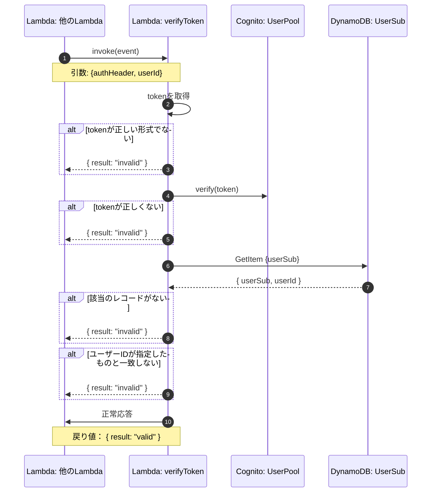
```mermaid
sequenceDiagram
  autonumber
  participant OL as Lambda: 他のLambda
  participant VT as Lambda: verifyToken
  participant COG as Cognito: UserPool
  participant DDB as DynamoDB: UserSub

  OL->>VT: invoke(event)
  note over OL, VT: 引数: {authHeader, userId}
  VT->>VT: tokenを取得
  alt tokenが正しい形式でない
    VT-->>OL: { result: "invalid" }
  end

  VT->>COG: verify(token)
  alt tokenが正しくない
    VT-->>OL: { result: "invalid" }
  end

  VT->>DDB: GetItem {userSub}
  DDB-->>VT: { userSub, userId }
  alt 該当のレコードがない
    VT-->>OL: { result: "invalid" }
  end
  alt ユーザーIDが指定したものと一致しない
    VT-->>OL: { result: "invalid" }
  end

  VT->>OL: 正常応答
  note over VT, OL: 戻り値： { result: "valid" }
```

### トークン-検証&UserSub取得 API

#### 処理フロー

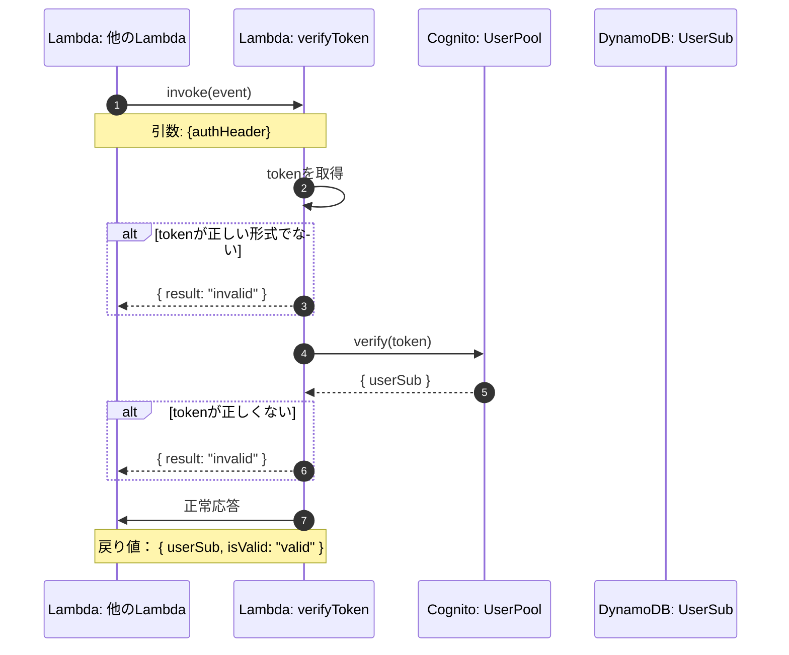
```mermaid
sequenceDiagram
  autonumber
  participant OL as Lambda: 他のLambda
  participant VT as Lambda: verifyToken
  participant COG as Cognito: UserPool
  participant DDB as DynamoDB: UserSub

  OL->>VT: invoke(event)
  note over OL, VT: 引数: {authHeader}
  VT->>VT: tokenを取得
  alt tokenが正しい形式でない
    VT-->>OL: { result: "invalid" }
  end

  VT->>COG: verify(token)
  COG-->>VT: { userSub }
  alt tokenが正しくない
    VT-->>OL: { result: "invalid" }
  end

  VT->>OL: 正常応答
  note over VT, OL: 戻り値： { userSub, isValid: "valid" }
```

### エモート群-取得 API

#### 処理フロー

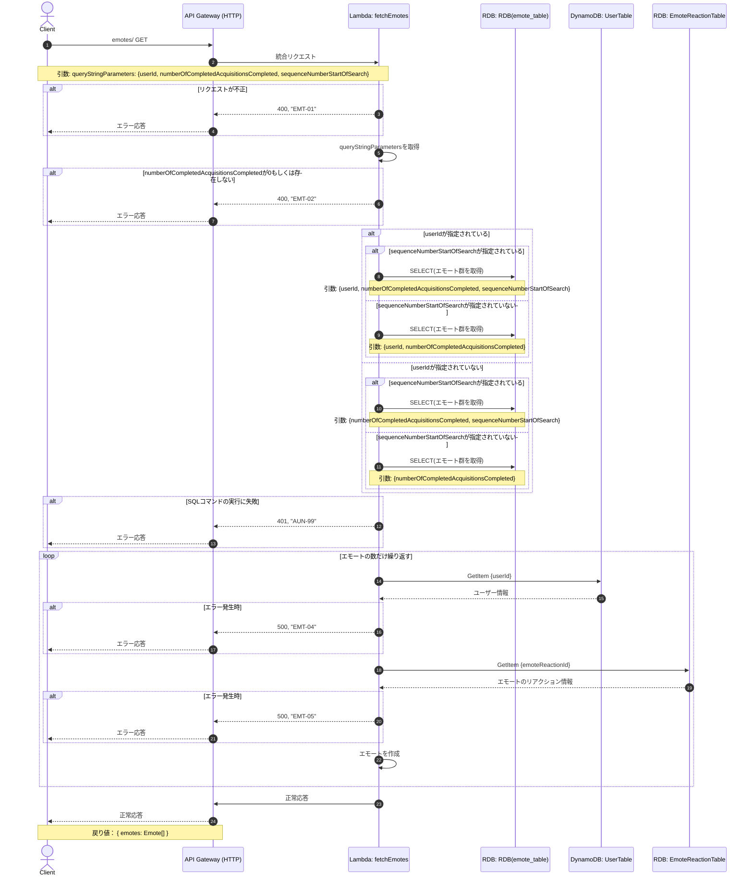
```mermaid
sequenceDiagram
  autonumber
  actor Client
  participant APIGW as API Gateway (HTTP)
  participant FE as Lambda: fetchEmotes
  participant RDB as RDB: RDB(emote_table)
  participant UDB as DynamoDB: UserTable
  participant ERDB as RDB: EmoteReactionTable

  Client->>APIGW: emotes/ GET
  APIGW->>FE: 統合リクエスト
  note over Client, FE: 引数: queryStringParameters: {userId, numberOfCompletedAcquisitionsCompleted, sequenceNumberStartOfSearch}
  alt リクエストが不正
    FE-->>APIGW: 400, "EMT-01"
    APIGW-->>Client: エラー応答
  end

  FE->>FE: queryStringParametersを取得
  alt numberOfCompletedAcquisitionsCompletedが0もしくは存在しない
    FE-->>APIGW: 400, "EMT-02"
    APIGW-->>Client: エラー応答
  end

  alt userIdが指定されている
    alt sequenceNumberStartOfSearchが指定されている
      FE->>RDB: SELECT(エモート群を取得)
      note over FE, RDB: 引数: {userId, numberOfCompletedAcquisitionsCompleted, sequenceNumberStartOfSearch}
    else sequenceNumberStartOfSearchが指定されていない
      FE->>RDB: SELECT(エモート群を取得)
      note over FE, RDB: 引数: {userId, numberOfCompletedAcquisitionsCompleted}
    end
  else userIdが指定されていない
    alt sequenceNumberStartOfSearchが指定されている
    FE->>RDB: SELECT(エモート群を取得)
      note over FE, RDB: 引数: {numberOfCompletedAcquisitionsCompleted, sequenceNumberStartOfSearch}
    else sequenceNumberStartOfSearchが指定されていない
      FE->>RDB: SELECT(エモート群を取得)
      note over FE, RDB: 引数: {numberOfCompletedAcquisitionsCompleted}
    end
  end

  alt SQLコマンドの実行に失敗
    FE-->>APIGW: 401, "AUN-99"
    APIGW-->>Client: エラー応答
  end

  loop エモートの数だけ繰り返す
    FE->>UDB: GetItem {userId}
    UDB-->>FE: ユーザー情報
    alt エラー発生時
      FE-->>APIGW: 500, "EMT-04"
      APIGW-->>Client: エラー応答
    end
    FE->>ERDB: GetItem {emoteReactionId}
    ERDB-->>FE: エモートのリアクション情報
    alt エラー発生時
      FE-->>APIGW: 500, "EMT-05"
      APIGW-->>Client: エラー応答
    end
    FE->>FE: エモートを作成
  end

  FE->>APIGW: 正常応答
  APIGW-->>Client: 正常応答
  note over APIGW, Client: 戻り値： { emotes: Emote[] }
```

#### エラー一覧

| エラーコード | ステータス | 条件                                                                                           |
| ------------ | ---------- | ---------------------------------------------------------------------------------------------- |
| EMT-01       | 400        | リクエストのqueryStringParametersが存在しない                                                  |
| EMT-02       | 400        | リクエストのqueryStringParametersのnumberOfCompletedAcquisitionsCompletedが0もしくは存在しない |
| EMT-03       | 400        | SQLコマンドの実行に失敗                                                                        |
| EMT-04       | 500        | UserTableとの接続に失敗                                                                        |
| EMT-05       | 500        | EmoteReactionTableとの接続に失敗                                                               |

### エモート-削除 API

#### 処理フロー

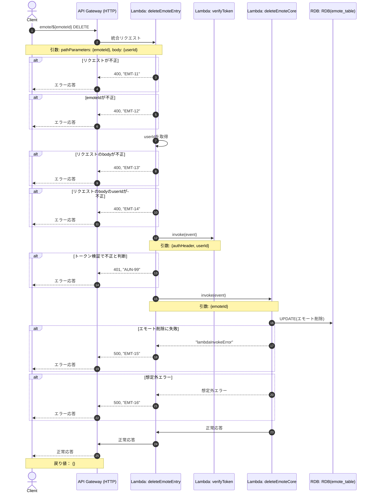
```mermaid
sequenceDiagram
  autonumber
  actor Client
  participant APIGW as API Gateway (HTTP)
  participant DELEntry as Lambda: deleteEmoteEntry
  participant VT as Lambda: verifyToken
  participant DELCore as Lambda: deleteEmoteCore
  participant RDB as RDB: RDB(emote_table)

  Client->>APIGW: emote/${emoteId} DELETE
  APIGW->>DELEntry: 統合リクエスト
  note over Client, DELEntry: 引数: pathParameters: {emoteId}, body: {userId}
  alt リクエストが不正
    DELEntry-->>APIGW: 400, "EMT-11"
    APIGW-->>Client: エラー応答
  end
  alt emoteIdが不正
    DELEntry-->>APIGW: 400, "EMT-12"
    APIGW-->>Client: エラー応答
  end

  DELEntry->>DELEntry: userIdを取得
  alt リクエストのbodyが不正
    DELEntry-->>APIGW: 400, "EMT-13"
    APIGW-->>Client: エラー応答
  end
  alt リクエストのbodyのuserIdが不正
    DELEntry-->>APIGW: 400, "EMT-14"
    APIGW-->>Client: エラー応答
  end

  DELEntry->>VT: invoke(event)
  note over DELEntry, VT: 引数: {authHeader, userId}
  alt トークン検証で不正と判断
    DELEntry-->>APIGW: 401, "AUN-99"
    APIGW-->>Client: エラー応答
  end

  DELEntry->>DELCore: invoke(event)
  note over DELEntry, DELCore: 引数: {emoteId}

  DELCore->>RDB: UPDATE(エモート削除)
  alt エモート削除に失敗
    DELCore-->>DELEntry: "lambdaInvokeError"
    DELEntry-->>APIGW: 500, "EMT-15"
    APIGW-->>Client: エラー応答
  end
  alt 想定外エラー
    DELCore-->>DELEntry: 想定外エラー
    DELEntry-->>APIGW: 500, "EMT-16"
    APIGW-->>Client: エラー応答
  end

  DELCore->>DELEntry: 正常応答
  DELEntry->>APIGW: 正常応答
  APIGW-->>Client: 正常応答
  note over APIGW, Client: 戻り値： {}
```

#### エラー一覧

| エラーコード | ステータス | 条件                                               |
| ------------ | ---------- | -------------------------------------------------- |
| EMT-11       | 400        | リクエストのpathParametersないしはbodyが存在しない |
| EMT-12       | 404        | リクエストのemoteIdが存在しない                    |
| EMT-13       | 500        | リクエストのbodyがJSON形式でない                   |
| EMT-14       | 404        | リクエストのbodyのuserIdが存在しない               |
| EMT-15       | 500        | RDBに対するUPDATE処理が失敗                        |
| EMT-16       | 400        | 想定外エラー                                       |
| AUN-99       | 400        | トークン検証で不正と判断                           |

### フォロワー-取得 API

#### 処理フロー

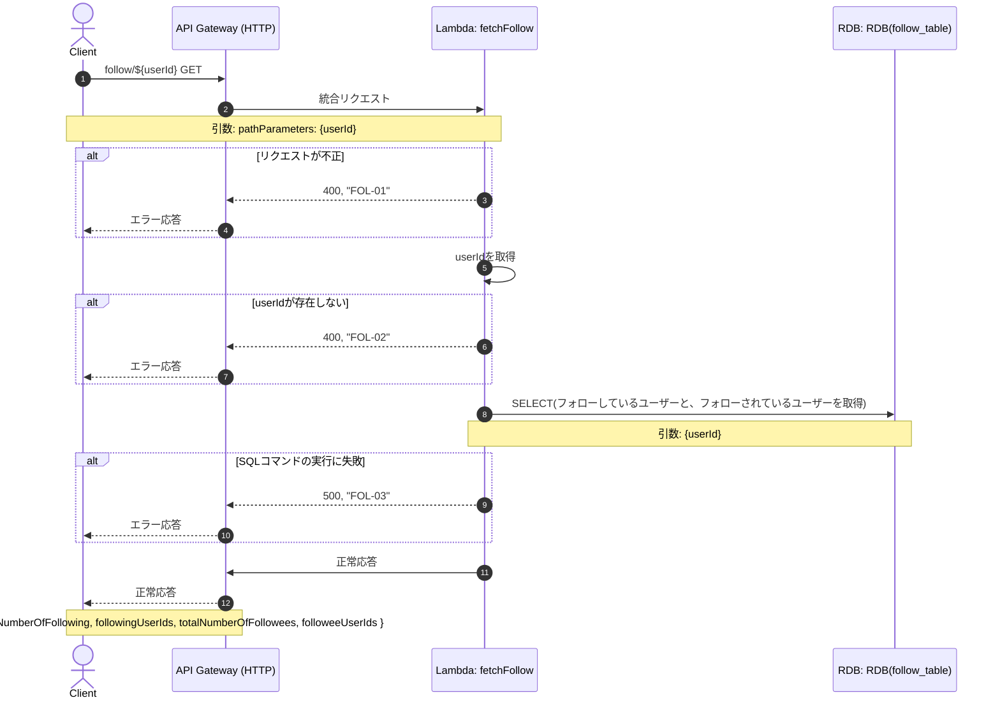
```mermaid
sequenceDiagram
  autonumber
  actor Client
  participant APIGW as API Gateway (HTTP)
  participant FE as Lambda: fetchFollow
  participant RDB as RDB: RDB(follow_table)

  Client->>APIGW: follow/${userId} GET
  APIGW->>FE: 統合リクエスト
  note over Client, FE: 引数: pathParameters: {userId}
  alt リクエストが不正
    FE-->>APIGW: 400, "FOL-01"
    APIGW-->>Client: エラー応答
  end

  FE->>FE: userIdを取得
  alt userIdが存在しない
    FE-->>APIGW: 400, "FOL-02"
    APIGW-->>Client: エラー応答
  end

  FE->>RDB: SELECT(フォローしているユーザーと、フォローされているユーザーを取得)
  note over FE, RDB: 引数: {userId}
  alt SQLコマンドの実行に失敗
    FE-->>APIGW: 500, "FOL-03"
    APIGW-->>Client: エラー応答
  end

  FE->>APIGW: 正常応答
  APIGW-->>Client: 正常応答
  note over APIGW, Client: 戻り値： { totalNumberOfFollowing, followingUserIds, totalNumberOfFollowees, followeeUserIds }
```

#### エラー一覧

| エラーコード | ステータス | 条件                                   |
| ------------ | ---------- | -------------------------------------- |
| FOL-01       | 400        | リクエストのpathParametersが存在しない |
| FOL-02       | 400        | リクエストのuserIdが存在しない         |
| FOL-03       | 500        | SQLコマンドの実行に失敗                |
| AUN-99       | 400        | トークン検証で不正と判断               |

### フォロワー-登録 API

#### 処理フロー

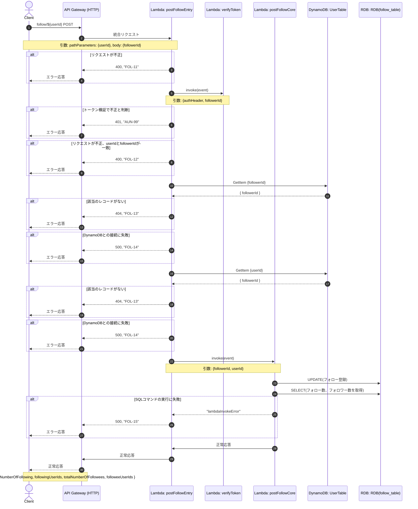
```mermaid
sequenceDiagram
  autonumber
  actor Client
  participant APIGW as API Gateway (HTTP)
  participant POSTEntry as Lambda: postFollowEntry
  participant VT as Lambda: verifyToken
  participant POSTCore as Lambda: postFollowCore
  participant DDB as DynamoDB: UserTable
  participant RDB as RDB: RDB(follow_table)

  Client->>APIGW: follow/${userId} POST
  APIGW->>POSTEntry: 統合リクエスト
  note over Client, POSTEntry: 引数: pathParameters: {userId}, body: {followerId}
  alt リクエストが不正
    POSTEntry-->>APIGW: 400, "FOL-11"
    APIGW-->>Client: エラー応答
  end

  POSTEntry->>VT: invoke(event)
  note over POSTEntry, VT: 引数: {authHeader, followerId}
  alt トークン検証で不正と判断
    POSTEntry-->>APIGW: 401, "AUN-99"
    APIGW-->>Client: エラー応答
  end

  alt リクエストが不正、userIdとfollowerIdが一致
    POSTEntry-->>APIGW: 400, "FOL-12"
    APIGW-->>Client: エラー応答
  end

  POSTEntry->>DDB: GetItem {followerId}
  DDB-->>POSTEntry: { followerId }
  alt 該当のレコードがない
    POSTEntry-->>APIGW: 404, "FOL-13"
    APIGW-->>Client: エラー応答
  end
  alt DynamoDBとの接続に失敗
    POSTEntry-->>APIGW: 500, "FOL-14"
    APIGW-->>Client: エラー応答
  end

  POSTEntry->>DDB: GetItem {userId}
  DDB-->>POSTEntry: { followerId }
  alt 該当のレコードがない
    POSTEntry-->>APIGW: 404, "FOL-13"
    APIGW-->>Client: エラー応答
  end
  alt DynamoDBとの接続に失敗
    POSTEntry-->>APIGW: 500, "FOL-14"
    APIGW-->>Client: エラー応答
  end

  POSTEntry->>POSTCore: invoke(event)
  note over POSTEntry, POSTCore: 引数: {followerId, userId}

  POSTCore->>RDB: UPDATE(フォロー登録)
  POSTCore->>RDB: SELECT(フォロー数、フォロワー数を取得)
  alt SQLコマンドの実行に失敗
    POSTCore-->>POSTEntry: "lambdaInvokeError"
    POSTEntry-->>APIGW: 500, "FOL-15"
    APIGW-->>Client: エラー応答
  end

  POSTCore->>POSTEntry: 正常応答
  POSTEntry->>APIGW: 正常応答
  APIGW-->>Client: 正常応答
  note over APIGW, Client: 戻り値： {totalNumberOfFollowing, followingUserIds, totalNumberOfFollowees, followeeUserIds }
```

#### エラー一覧

| エラーコード | ステータス | 条件                                                                         |
| ------------ | ---------- | ---------------------------------------------------------------------------- |
| FOL-11       | 400        | リクエストのpathParametersないしはbodyが存在しない                           |
| FOL-12       | 404        | リクエストのuserIdもしくはfollowerIdが存在しないか、followerIdとuserIdが一致 |
| FOL-13       | 500        | userIdないしはfollowerIdのユーザーが存在しない                               |
| FOL-14       | 500        | DynamoDBとの接続に失敗                                                       |
| FOL-15       | 500        | SQLコマンドの実行に失敗                                                      |
| AUN-99       | 400        | トークン検証で不正と判断                                                     |

### フォロワー-削除 API

#### 処理フロー

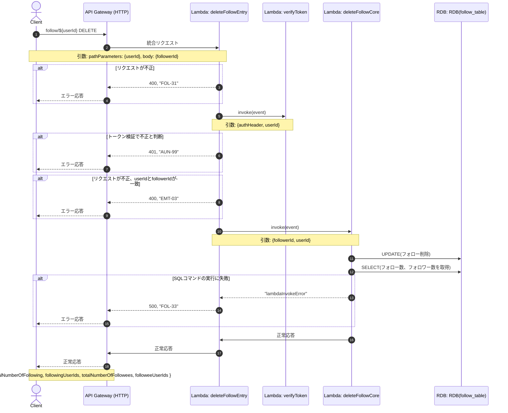
```mermaid
sequenceDiagram
  autonumber
  actor Client
  participant APIGW as API Gateway (HTTP)
  participant DELEntry as Lambda: deleteFollowEntry
  participant VT as Lambda: verifyToken
  participant DELCore as Lambda: deleteFollowCore
  participant RDB as RDB: RDB(follow_table)

  Client->>APIGW: follow/${userId} DELETE
  APIGW->>DELEntry: 統合リクエスト
  note over Client, DELEntry: 引数: pathParameters: {userId}, body: {followerId}
  alt リクエストが不正
    DELEntry-->>APIGW: 400, "FOL-31"
    APIGW-->>Client: エラー応答
  end

  DELEntry->>VT: invoke(event)
  note over DELEntry, VT: 引数: {authHeader, userId}
  alt トークン検証で不正と判断
    DELEntry-->>APIGW: 401, "AUN-99"
    APIGW-->>Client: エラー応答
  end

  alt リクエストが不正、userIdとfollowerIdが一致
    DELEntry-->>APIGW: 400, "EMT-03"
    APIGW-->>Client: エラー応答
  end

  DELEntry->>DELCore: invoke(event)
  note over DELEntry, DELCore: 引数: {followerId, userId}

  DELCore->>RDB: UPDATE(フォロー削除)
  DELCore->>RDB: SELECT(フォロー数、フォロワー数を取得)
  alt SQLコマンドの実行に失敗
    DELCore-->>DELEntry: "lambdaInvokeError"
    DELEntry-->>APIGW: 500, "FOL-33"
    APIGW-->>Client: エラー応答
  end

  DELCore->>DELEntry: 正常応答
  DELEntry->>APIGW: 正常応答
  APIGW-->>Client: 正常応答
  note over APIGW, Client: 戻り値： {totalNumberOfFollowing, followingUserIds, totalNumberOfFollowees, followeeUserIds }
```

#### エラー一覧

| エラーコード | ステータス | 条件                                                                         |
| ------------ | ---------- | ---------------------------------------------------------------------------- |
| FOL-31       | 400        | リクエストのpathParametersないしはbodyが存在しない                           |
| FOL-32       | 404        | リクエストのuserIdもしくはfollowerIdが存在しないか、followerIdとuserIdが一致 |
| FOL-33       | 500        | RDBに対するSQLコマンドの実行が失敗                                           |
| AUN-99       | 400        | トークン検証で不正と判断                                                     |

### ユーザー-取得 API

#### 処理フロー

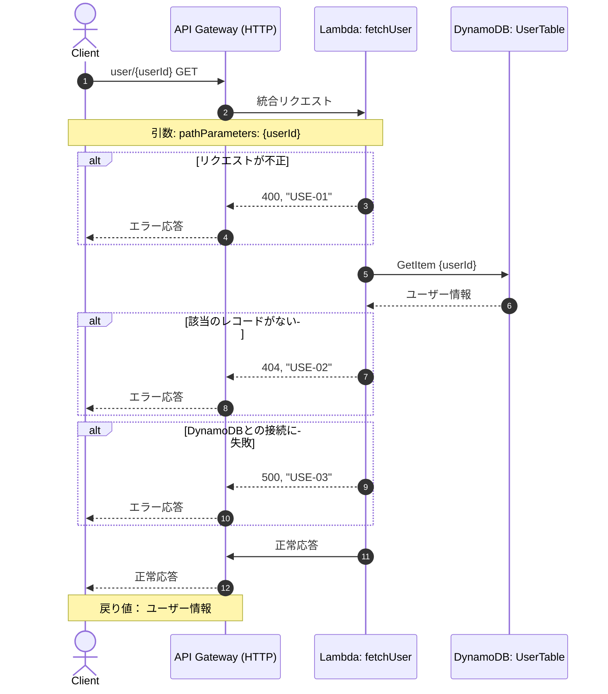
```mermaid
sequenceDiagram
  autonumber
  actor Client
  participant APIGW as API Gateway (HTTP)
  participant FE as Lambda: fetchUser
  participant UDB as DynamoDB: UserTable

  Client->>APIGW: user/{userId} GET
  APIGW->>FE: 統合リクエスト
  note over Client, FE: 引数: pathParameters: {userId}
  alt リクエストが不正
    FE-->>APIGW: 400, "USE-01"
    APIGW-->>Client: エラー応答
  end

  FE->>UDB: GetItem {userId}
  UDB-->>FE: ユーザー情報
  alt 該当のレコードがない
    FE-->>APIGW: 404, "USE-02"
    APIGW-->>Client: エラー応答
  end
  alt DynamoDBとの接続に失敗
    FE-->>APIGW: 500, "USE-03"
    APIGW-->>Client: エラー応答
  end

  FE->>APIGW: 正常応答
  APIGW-->>Client: 正常応答
  note over APIGW, Client: 戻り値： ユーザー情報
```

#### エラー一覧

| エラーコード | ステータス | 条件                                   |
| ------------ | ---------- | -------------------------------------- |
| USE-01       | 400        | リクエストのpathParametersが存在しない |
| USE-02       | 404        | リクエストのuserIdが存在しない         |
| USE-03       | 500        | DynamoDBとの接続に失敗                 |

### ユーザー名-登録 API

#### 処理フロー

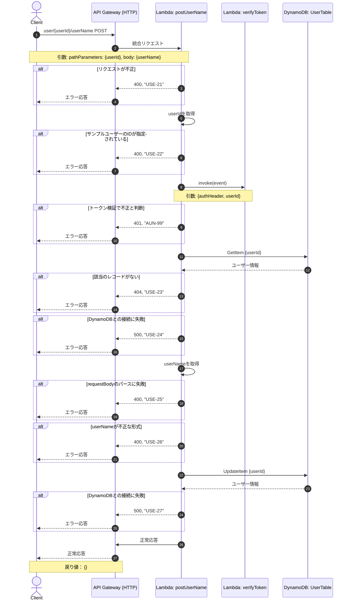
```mermaid
sequenceDiagram
  autonumber
  actor Client
  participant APIGW as API Gateway (HTTP)
  participant FE as Lambda: postUserName
  participant VT as Lambda: verifyToken
  participant UDB as DynamoDB: UserTable

  Client->>APIGW: user/{userId}/userName POST
  APIGW->>FE: 統合リクエスト
  note over Client, FE: 引数: pathParameters: {userId}, body: {userName}
  alt リクエストが不正
    FE-->>APIGW: 400, "USE-21"
    APIGW-->>Client: エラー応答
  end

  FE->>FE: userIdを取得
  alt サンプルユーザーのIDが指定されている
    FE-->>APIGW: 400, "USE-22"
    APIGW-->>Client: エラー応答
  end

  FE->>VT: invoke(event)
  note over FE, VT: 引数: {authHeader, userId}
  alt トークン検証で不正と判断
    FE-->>APIGW: 401, "AUN-99"
    APIGW-->>Client: エラー応答
  end

  FE->>UDB: GetItem {userId}
  UDB-->>FE: ユーザー情報
  alt 該当のレコードがない
    FE-->>APIGW: 404, "USE-23"
    APIGW-->>Client: エラー応答
  end
  alt DynamoDBとの接続に失敗
    FE-->>APIGW: 500, "USE-24"
    APIGW-->>Client: エラー応答
  end

  FE->>FE: userNameを取得
  alt requestBodyのパースに失敗
    FE-->>APIGW: 400, "USE-25"
    APIGW-->>Client: エラー応答
  end
  alt userNameが不正な形式
    FE-->>APIGW: 400, "USE-26"
    APIGW-->>Client: エラー応答
  end

  FE->>UDB: UpdateItem {userId}
  UDB-->>FE: ユーザー情報
  alt DynamoDBとの接続に失敗
    FE-->>APIGW: 500, "USE-27"
    APIGW-->>Client: エラー応答
  end

  FE->>APIGW: 正常応答
  APIGW-->>Client: 正常応答
  note over APIGW, Client: 戻り値： {}
```

#### エラー一覧

| エラーコード | ステータス | 条件                                               |
| ------------ | ---------- | -------------------------------------------------- |
| USE-21       | 400        | リクエストのpathParametersないしはbodyが存在しない |
| USE-22       | 400        | リクエストのuserIdがサンプルユーザーのIDである     |
| USE-23       | 404        | リクエストのuserIdが存在しない                     |
| USE-24       | 500        | DynamoDBとの接続に失敗                             |
| USE-25       | 400        | リクエストのbodyがJSON形式でない                   |
| USE-26       | 400        | リクエストのbodyのuserNameが不正な形式             |
| USE-27       | 500        | DynamoDBとの接続に失敗                             |
| AUN-99       | 400        | トークン検証で不正と判断                           |

### ユーザー-登録 API

#### 処理フロー

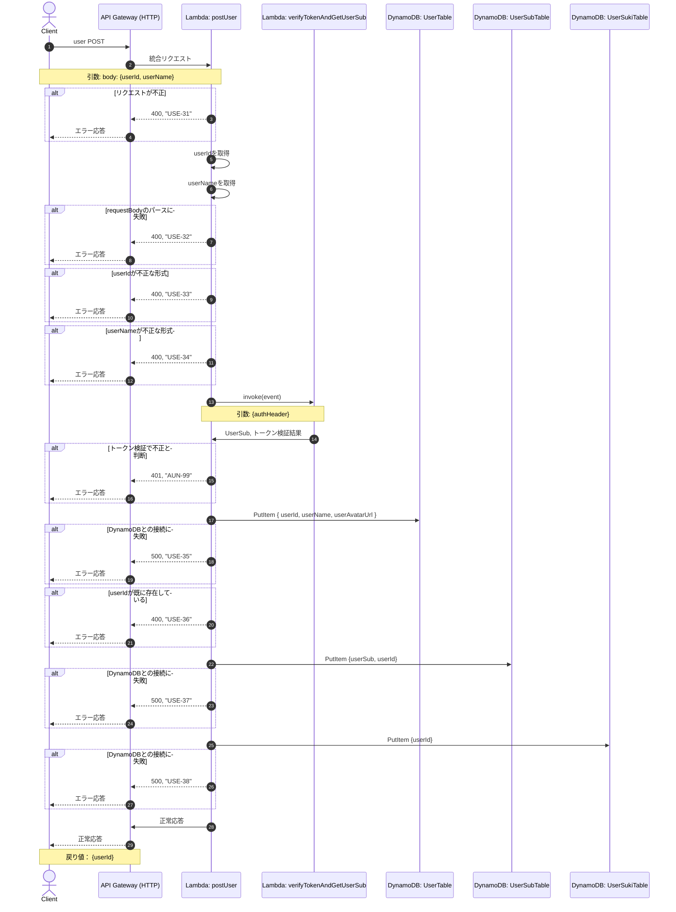
```mermaid
sequenceDiagram
  autonumber
  actor Client
  participant APIGW as API Gateway (HTTP)
  participant FE as Lambda: postUser
  participant VTGUS as Lambda: verifyTokenAndGetUserSub
  participant UDB as DynamoDB: UserTable
  participant UST as DynamoDB: UserSubTable
  participant USK as DynamoDB: UserSukiTable

  Client->>APIGW: user POST
  APIGW->>FE: 統合リクエスト
  note over Client, FE: 引数: body: {userId, userName}
  alt リクエストが不正
    FE-->>APIGW: 400, "USE-31"
    APIGW-->>Client: エラー応答
  end

  FE->>FE: userIdを取得
  FE->>FE: userNameを取得
  alt requestBodyのパースに失敗
    FE-->>APIGW: 400, "USE-32"
    APIGW-->>Client: エラー応答
  end
  alt userIdが不正な形式
    FE-->>APIGW: 400, "USE-33"
    APIGW-->>Client: エラー応答
  end
  alt userNameが不正な形式
    FE-->>APIGW: 400, "USE-34"
    APIGW-->>Client: エラー応答
  end

  FE->>VTGUS: invoke(event)
  note over FE, VTGUS: 引数: {authHeader}
  VTGUS->>FE: UserSub, トークン検証結果
  alt トークン検証で不正と判断
    FE-->>APIGW: 401, "AUN-99"
    APIGW-->>Client: エラー応答
  end

  FE->>UDB: PutItem { userId, userName, userAvatarUrl }
  alt DynamoDBとの接続に失敗
    FE-->>APIGW: 500, "USE-35"
    APIGW-->>Client: エラー応答
  end
  alt userIdが既に存在している
    FE-->>APIGW: 400, "USE-36"
    APIGW-->>Client: エラー応答
  end

  FE->>UST: PutItem {userSub, userId}
  alt DynamoDBとの接続に失敗
    FE-->>APIGW: 500, "USE-37"
    APIGW-->>Client: エラー応答
  end

  FE->>USK: PutItem {userId}
  alt DynamoDBとの接続に失敗
    FE-->>APIGW: 500, "USE-38"
    APIGW-->>Client: エラー応答
  end

  FE->>APIGW: 正常応答
  APIGW-->>Client: 正常応答
  note over APIGW, Client: 戻り値： {userId}
```

#### エラー一覧

| エラーコード | ステータス | 条件                                               |
| ------------ | ---------- | -------------------------------------------------- |
| USE-31       | 400        | リクエストのpathParametersないしはbodyが存在しない |
| USE-32       | 400        | リクエストボディのJSON変換に失敗                   |
| USE-33       | 400        | リクエストのuserIdが不正な形式                     |
| USE-34       | 400        | リクエストボディのuserNameが不正な形式             |
| USE-35       | 500        | userの登録時にDynamoDBとの接続に失敗               |
| USE-36       | 400        | リクエストのuserIdが既に存在している               |
| USE-37       | 500        | userSubの登録時にDynamoDBとの接続に失敗            |
| USE-38       | 500        | userSukiの登録時にDynamoDBとの接続に失敗           |
| AUN-99       | 400        | トークン検証で不正と判断                           |

### ユーザー-削除 API

#### 処理フロー

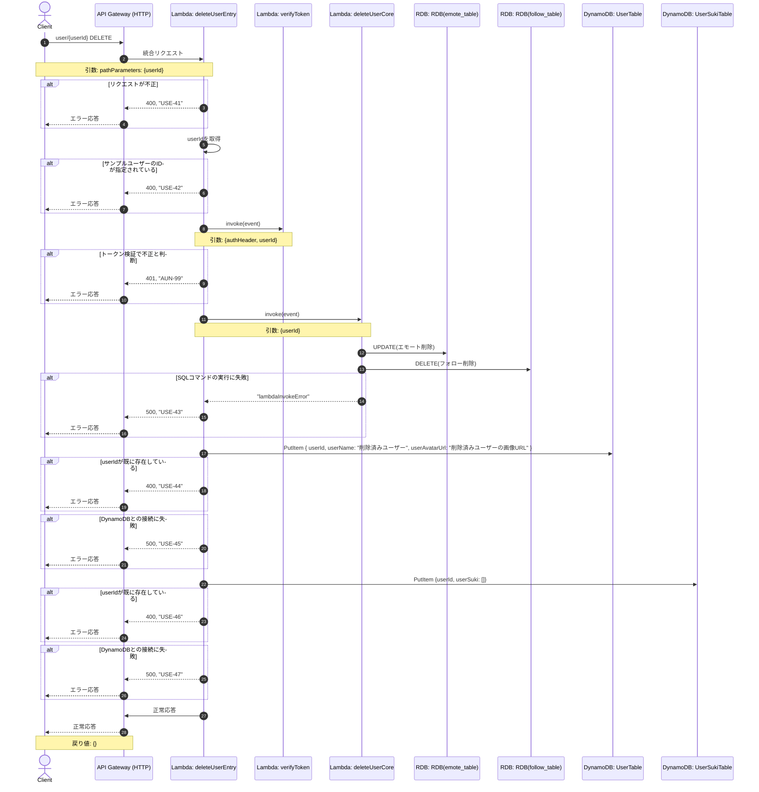
```mermaid
sequenceDiagram
  autonumber
  actor Client
  participant APIGW as API Gateway (HTTP)
  participant DELEntry as Lambda: deleteUserEntry
  participant VT as Lambda: verifyToken
  participant DELCore as Lambda: deleteUserCore
  participant EmoteRDB as RDB: RDB(emote_table)
  participant FollowRDB as RDB: RDB(follow_table)
  participant UDB as DynamoDB: UserTable
  participant USK as DynamoDB: UserSukiTable

  Client->>APIGW: user/{userId} DELETE
  APIGW->>DELEntry: 統合リクエスト
  note over Client, DELEntry: 引数: pathParameters: {userId}
  alt リクエストが不正
    DELEntry-->>APIGW: 400, "USE-41"
    APIGW-->>Client: エラー応答
  end

  DELEntry->>DELEntry: userIdを取得
  alt サンプルユーザーのIDが指定されている
    DELEntry-->>APIGW: 400, "USE-42"
    APIGW-->>Client: エラー応答
  end

  DELEntry->>VT: invoke(event)
  note over DELEntry, VT: 引数: {authHeader, userId}
  alt トークン検証で不正と判断
    DELEntry-->>APIGW: 401, "AUN-99"
    APIGW-->>Client: エラー応答
  end

  DELEntry->>DELCore: invoke(event)
  note over DELEntry, DELCore: 引数: {userId}

  DELCore->>EmoteRDB: UPDATE(エモート削除)
  DELCore->>FollowRDB: DELETE(フォロー削除)
  alt SQLコマンドの実行に失敗
    DELCore-->>DELEntry: "lambdaInvokeError"
    DELEntry-->>APIGW: 500, "USE-43"
    APIGW-->>Client: エラー応答
  end

  DELEntry->>UDB: PutItem { userId, userName: "削除済みユーザー", userAvatarUrl: "削除済みユーザーの画像URL" }
  alt userIdが既に存在している
    DELEntry-->>APIGW: 400, "USE-44"
    APIGW-->>Client: エラー応答
  end
  alt DynamoDBとの接続に失敗
    DELEntry-->>APIGW: 500, "USE-45"
    APIGW-->>Client: エラー応答
  end

  DELEntry->>USK: PutItem {userId, userSuki: []}
  alt userIdが既に存在している
    DELEntry-->>APIGW: 400, "USE-46"
    APIGW-->>Client: エラー応答
  end
  alt DynamoDBとの接続に失敗
    DELEntry-->>APIGW: 500, "USE-47"
    APIGW-->>Client: エラー応答
  end

  DELEntry->>APIGW: 正常応答
  APIGW-->>Client: 正常応答
  note over APIGW, Client: 戻り値: {}
```

#### エラー一覧

| エラーコード | ステータス | 条件                                               |
| ------------ | ---------- | -------------------------------------------------- |
| USE-41       | 400        | リクエストのpathParametersないしはbodyが存在しない |
| USE-42       | 400        | リクエストのuserIdがサンプルユーザーのIDである     |
| USE-43       | 500        | Lambdaの実行に失敗                                 |
| USE-44       | 400        | リクエストのuserIdが既に存在している               |
| USE-45       | 500        | ユーザー登録時、DynamoDBとの接続に失敗             |
| USE-46       | 400        | リクエストのuserIdが既に存在している               |
| USE-47       | 500        | ユーザースキ登録時、DynamoDBとの接続に失敗         |
| AUN-99       | 400        | トークン検証で不正と判断                           |

### ユーザー画像-アップロードURL取得 API

#### 処理フロー

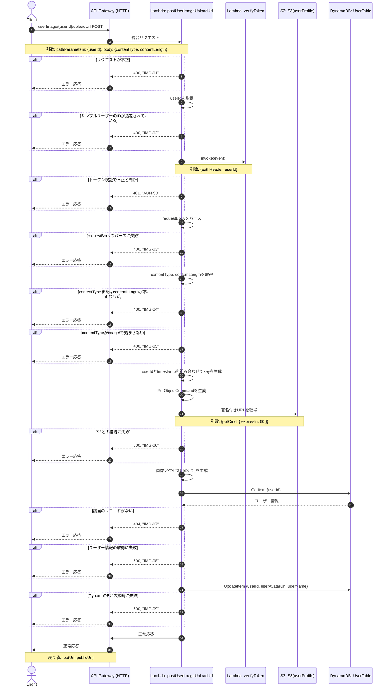
```mermaid
sequenceDiagram
  autonumber
  actor Client
  participant APIGW as API Gateway (HTTP)
  participant PUIL as Lambda: postUserImageUploadUrl
  participant VT as Lambda: verifyToken
  participant S3 as S3: S3(userProfile)
  participant UDB as DynamoDB: UserTable

  Client->>APIGW: userImage/{userId}/uploadUrl POST
  APIGW->>PUIL: 統合リクエスト
  note over Client, PUIL: 引数: pathParameters: {userId}, body: {contentType, contentLength}
  alt リクエストが不正
    PUIL-->>APIGW: 400, "IMG-01"
    APIGW-->>Client: エラー応答
  end

  PUIL->>PUIL: userIdを取得
  alt サンプルユーザーのIDが指定されている
    PUIL-->>APIGW: 400, "IMG-02"
    APIGW-->>Client: エラー応答
  end

  PUIL->>VT: invoke(event)
  note over PUIL, VT: 引数: {authHeader, userId}
  alt トークン検証で不正と判断
    PUIL-->>APIGW: 401, "AUN-99"
    APIGW-->>Client: エラー応答
  end

  PUIL->>PUIL: requestBodyをパース
  alt requestBodyのパースに失敗
    PUIL-->>APIGW: 400, "IMG-03"
    APIGW-->>Client: エラー応答
  end

  PUIL->>PUIL: contentType, contentLengthを取得
  alt contentTypeまたはcontentLengthが不正な形式
    PUIL-->>APIGW: 400, "IMG-04"
    APIGW-->>Client: エラー応答
  end
  alt contentTypeがimage/で始まらない
    PUIL-->>APIGW: 400, "IMG-05"
    APIGW-->>Client: エラー応答
  end

  PUIL->>PUIL: userIdとtimestampを組み合わせてkeyを生成
  PUIL->>PUIL: PutObjectCommandを生成

  PUIL->>S3: 署名付きURLを取得
  note over PUIL, S3: 引数: {putCmd, { expiresIn: 60 }}
  alt S3との接続に失敗
    PUIL-->>APIGW: 500, "IMG-06"
    APIGW-->>Client: エラー応答
  end

  PUIL->>PUIL: 画像アクセス用のURLを生成

  PUIL->>UDB: GetItem {userId}
  UDB-->>PUIL: ユーザー情報
  alt 該当のレコードがない
    PUIL-->>APIGW: 404, "IMG-07"
    APIGW-->>Client: エラー応答
  end
  alt ユーザー情報の取得に失敗
    PUIL-->>APIGW: 500, "IMG-08"
    APIGW-->>Client: エラー応答
  end

  PUIL->>UDB: UpdateItem {userId, userAvatarUrl, userName}
  alt DynamoDBとの接続に失敗
    PUIL-->>APIGW: 500, "IMG-09"
    APIGW-->>Client: エラー応答
  end

  PUIL->>APIGW: 正常応答
  APIGW-->>Client: 正常応答
  note over APIGW, Client: 戻り値: {putUrl, publicUrl}
```

#### エラー一覧

| エラーコード | ステータス | 条件                                                         |
| ------------ | ---------- | ------------------------------------------------------------ |
| IMG-01       | 400        | リクエストのpathParametersないしはbodyが存在しない           |
| IMG-02       | 400        | リクエストのuserIdがサンプルユーザーのIDである               |
| IMG-03       | 400        | リクエストボディのJSON変換に失敗                             |
| IMG-04       | 400        | リクエストボディのcontentTypeまたはcontentLengthが不正な形式 |
| IMG-05       | 400        | リクエストボディのcontentTypeがimage/で始まらない            |
| IMG-06       | 500        | S3との接続に失敗                                             |
| IMG-07       | 404        | リクエストのuserIdが存在しない                               |
| IMG-08       | 500        | ユーザー情報の取得に失敗                                     |
| IMG-09       | 500        | ユーザー情報の更新に失敗                                     |
| AUN-99       | 400        | トークン検証で不正と判断                                     |

### ユーザーsub-取得 API

#### 処理フロー

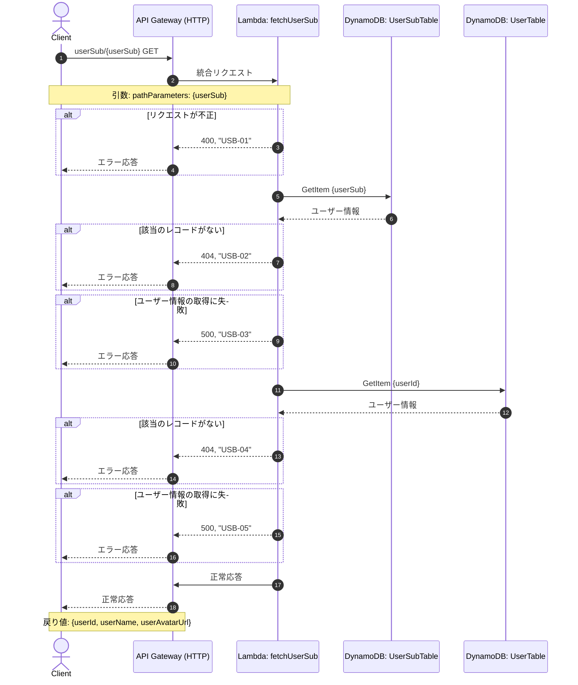
```mermaid
sequenceDiagram
  autonumber
  actor Client
  participant APIGW as API Gateway (HTTP)
  participant FE as Lambda: fetchUserSub
  participant USB as DynamoDB: UserSubTable
  participant UDB as DynamoDB: UserTable

  Client->>APIGW: userSub/{userSub} GET
  APIGW->>FE: 統合リクエスト
  note over Client, FE: 引数: pathParameters: {userSub}
  alt リクエストが不正
    FE-->>APIGW: 400, "USB-01"
    APIGW-->>Client: エラー応答
  end

  FE->>USB: GetItem {userSub}
  USB-->>FE: ユーザー情報
  alt 該当のレコードがない
    FE-->>APIGW: 404, "USB-02"
    APIGW-->>Client: エラー応答
  end
  alt ユーザー情報の取得に失敗
    FE-->>APIGW: 500, "USB-03"
    APIGW-->>Client: エラー応答
  end

  FE->>UDB: GetItem {userId}
  UDB-->>FE: ユーザー情報
  alt 該当のレコードがない
    FE-->>APIGW: 404, "USB-04"
    APIGW-->>Client: エラー応答
  end
  alt ユーザー情報の取得に失敗
    FE-->>APIGW: 500, "USB-05"
    APIGW-->>Client: エラー応答
  end

  FE->>APIGW: 正常応答
  APIGW-->>Client: 正常応答
  note over APIGW, Client: 戻り値: {userId, userName, userAvatarUrl}
```

#### エラー一覧

| エラーコード | ステータス | 条件                                               |
| ------------ | ---------- | -------------------------------------------------- |
| USB-01       | 400        | リクエストのpathParametersないしはbodyが存在しない |
| USB-02       | 404        | リクエストのuserSubが存在しない                    |
| USB-03       | 500        | ユーザー情報の取得に失敗                           |
| USB-04       | 404        | リクエストのuserIdが存在しない                     |
| USB-05       | 500        | ユーザー情報の取得に失敗                           |

### ユーザースキ-取得 API

#### 処理フロー

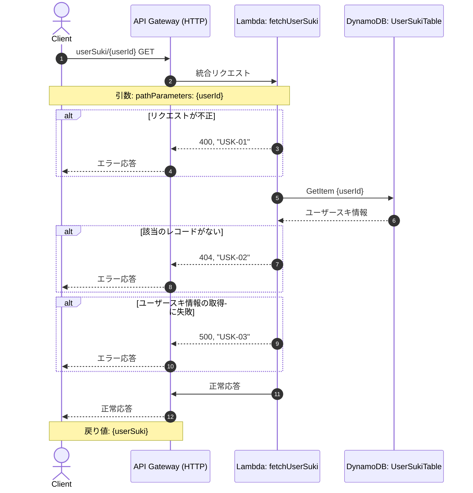
```mermaid
sequenceDiagram
  autonumber
  actor Client
  participant APIGW as API Gateway (HTTP)
  participant FE as Lambda: fetchUserSuki
  participant USK as DynamoDB: UserSukiTable

  Client->>APIGW: userSuki/{userId} GET
  APIGW->>FE: 統合リクエスト
  note over Client, FE: 引数: pathParameters: {userId}
  alt リクエストが不正
    FE-->>APIGW: 400, "USK-01"
    APIGW-->>Client: エラー応答
  end

  FE->>USK: GetItem {userId}
  USK-->>FE: ユーザースキ情報
  alt 該当のレコードがない
    FE-->>APIGW: 404, "USK-02"
    APIGW-->>Client: エラー応答
  end
  alt ユーザースキ情報の取得に失敗
    FE-->>APIGW: 500, "USK-03"
    APIGW-->>Client: エラー応答
  end

  FE->>APIGW: 正常応答
  APIGW-->>Client: 正常応答
  note over APIGW, Client: 戻り値: {userSuki}
```

#### エラー一覧

| エラーコード | ステータス | 条件                                          |
| ------------ | ---------- | --------------------------------------------- |
| USK-01       | 400        | リクエストのpathParameters,userIdが存在しない |
| USK-02       | 404        | リクエストのuserIdがデータベースに存在しない  |
| USK-03       | 500        | ユーザースキの取得に失敗                      |
| AUN-99       | 400        | トークン検証で不正と判断                      |

### ユーザースキ-登録 API

#### 処理フロー

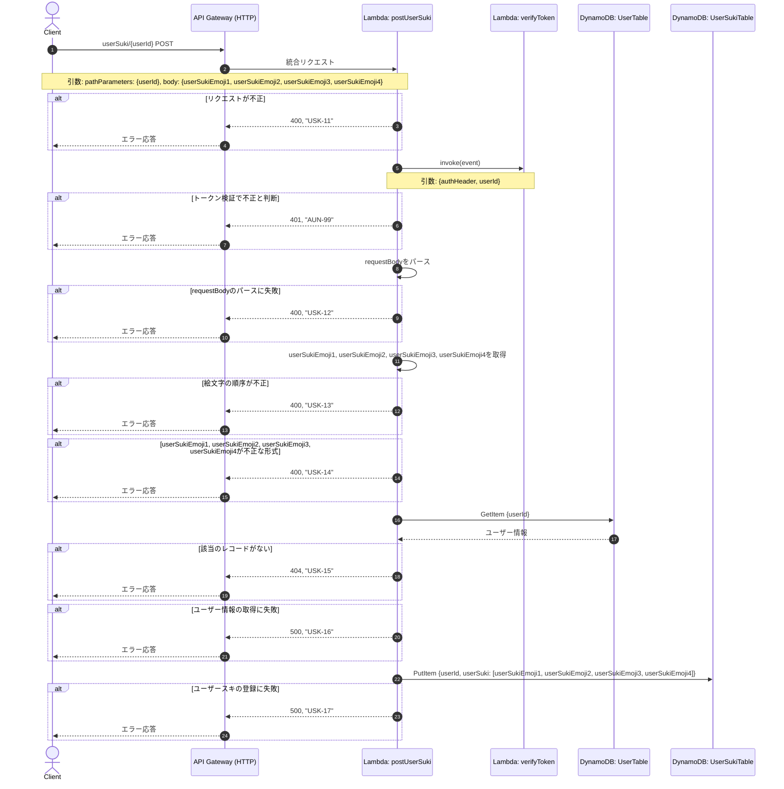
```mermaid
sequenceDiagram
  autonumber
  actor Client
  participant APIGW as API Gateway (HTTP)
  participant FE as Lambda: postUserSuki
  participant VT as Lambda: verifyToken
  participant UDB as DynamoDB: UserTable
  participant USK as DynamoDB: UserSukiTable

  Client->>APIGW: userSuki/{userId} POST
  APIGW->>FE: 統合リクエスト
  note over Client, FE: 引数: pathParameters: {userId}, body: {userSukiEmoji1, userSukiEmoji2, userSukiEmoji3, userSukiEmoji4}
  alt リクエストが不正
    FE-->>APIGW: 400, "USK-11"
    APIGW-->>Client: エラー応答
  end

  FE->>VT: invoke(event)
  note over FE, VT: 引数: {authHeader, userId}
  alt トークン検証で不正と判断
    FE-->>APIGW: 401, "AUN-99"
    APIGW-->>Client: エラー応答
  end

  FE->>FE: requestBodyをパース
  alt requestBodyのパースに失敗
    FE-->>APIGW: 400, "USK-12"
    APIGW-->>Client: エラー応答
  end

  FE->>FE: userSukiEmoji1, userSukiEmoji2, userSukiEmoji3, userSukiEmoji4を取得
  alt 絵文字の順序が不正
    FE-->>APIGW: 400, "USK-13"
    APIGW-->>Client: エラー応答
  end
  alt userSukiEmoji1, userSukiEmoji2, userSukiEmoji3, userSukiEmoji4が不正な形式
    FE-->>APIGW: 400, "USK-14"
    APIGW-->>Client: エラー応答
  end

  FE->>UDB: GetItem {userId}
  UDB-->>FE: ユーザー情報
  alt 該当のレコードがない
    FE-->>APIGW: 404, "USK-15"
    APIGW-->>Client: エラー応答
  end
  alt ユーザー情報の取得に失敗
    FE-->>APIGW: 500, "USK-16"
    APIGW-->>Client: エラー応答
  end

  FE->>USK: PutItem {userId, userSuki: [userSukiEmoji1, userSukiEmoji2, userSukiEmoji3, userSukiEmoji4]}
  alt ユーザースキの登録に失敗
    FE-->>APIGW: 500, "USK-17"
    APIGW-->>Client: エラー応答
  end
```

#### エラー一覧

| エラーコード | ステータス | 条件                                                                                    |
| ------------ | ---------- | --------------------------------------------------------------------------------------- |
| USK-11       | 400        | pathParametersないしはbodyが存在しない                                                  |
| USK-12       | 400        | requestBodyのJSON変換に失敗                                                             |
| USK-13       | 400        | 絵文字が空の絵文字入力（投稿終了）の後に指定された時                                    |
| USK-14       | 400        | requestBodyのuserSukiEmoji1, userSukiEmoji2, userSukiEmoji3, userSukiEmoji4が不正な形式 |
| USK-15       | 400        | リクエストのuserIdがデータベースに存在しない                                            |
| USK-16       | 400        | UserTableとの接続に失敗                                                                 |
| USK-17       | 400        | UserSukiTableとの接続に失敗                                                             |
| AUN-99       | 400        | トークン検証で不正と判断                                                                |

## コンタクト

- [GitHub履歴書](https://github.com/kagamaru)

## 環境変数の一覧

| 環境変数名                                   | 説明                                       |
| -------------------------------------------- | ------------------------------------------ |
| LAMBDA_SECURITY_GROUP_ID                     | Lambda のセキュリティグループID            |
| VPC_PUBLIC_SUBNET_ID_A                       | VPC のパブリックサブネットID(Lambda接続用) |
| VPC_PUBLIC_SUBNET_ID_B                       | VPC のパブリックサブネットID(Lambda接続用) |
| DB_HOST                                      | RDS のホスト                               |
| DB_USER                                      | RDS のユーザー名                           |
| DB_PASSWORD                                  | RDS のパスワード                           |
| DB_NAME                                      | RDS のデータベース名                       |
| FRONTEND_URL                                 | フロントエンドのURL                        |
| COGNITO_USER_POOL_ID                         | Cognito のユーザープールID                 |
| COGNITO_USER_POOL_ARN                        | Cognito のユーザープールARN                |
| COGNITO_CLIENT_ID                            | Cognito のクライアントID                   |
| COGNITO_AUTHORIZER_ID                        | Cognito の認証者ID                         |
| USER_IMAGE_BUCKET                            | ユーザー画像のS3バケット名                 |
| CLOUDFRONT_USER_IMAGE_URL                    | ユーザー画像のCloudFront URL               |
| MY_AWS_REGION                                | 使用しているAWS のリージョン               |
| TOKEN_VALIDATOR_LAMBDA_NAME                  | JWT検証用のLambda関数名                    |
| TOKEN_VALIDATOR_AND_GET_USER_SUB_LAMBDA_NAME | JWT検証用のLambda関数名                    |
| POST_FOLLOW_LAMBDA_NAME                      | フォロー-登録APIのLambda関数名(Core処理)   |
| DELETE_FOLLOW_LAMBDA_NAME                    | フォロー-削除APIのLambda関数名(Core処理)   |
| DELETE_EMOTE_LAMBDA_NAME                     | エモート-削除APIのLambda関数名(Core処理)   |
| DELETE_USER_LAMBDA_NAME                      | ユーザー-削除APIのLambda関数名(Core処理)   |
